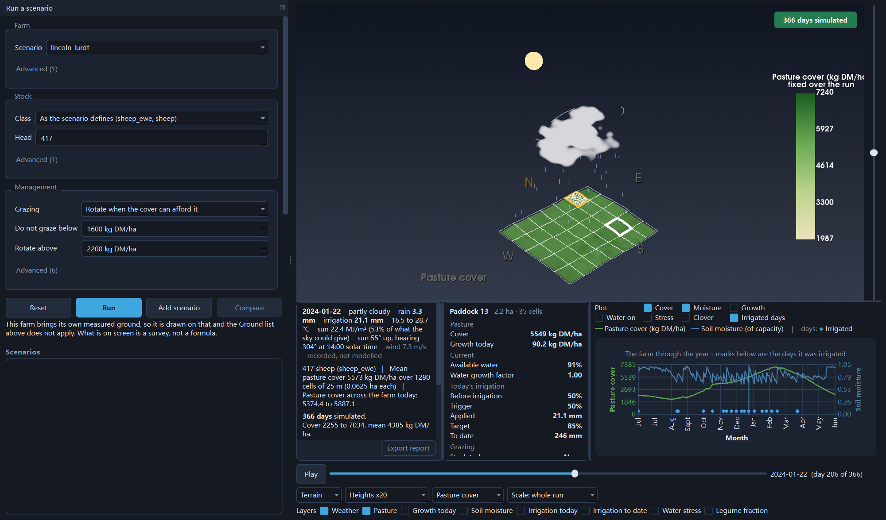
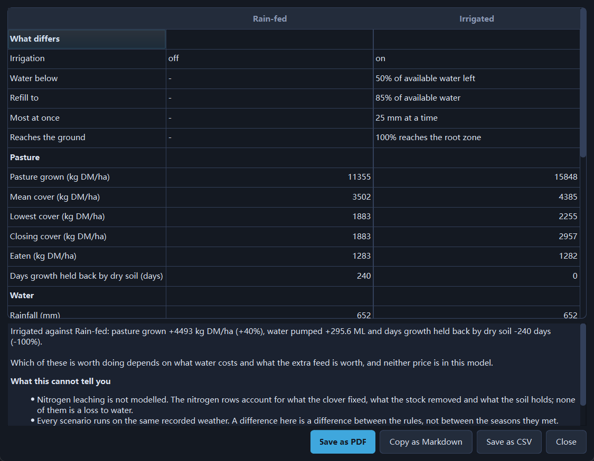
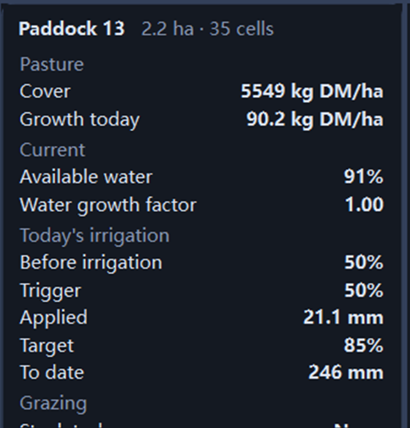
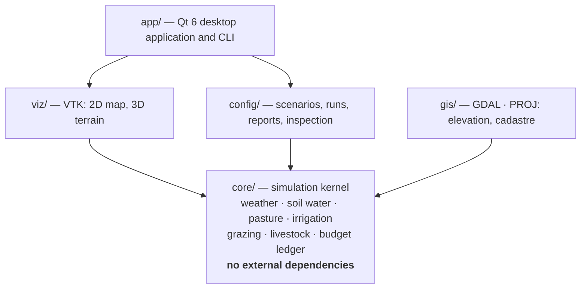

# Paddock

[](https://github.com/hugohu789-droid/Paddock/actions/workflows/ci.yml)


[](LICENSE)

A spatially explicit pastoral farm simulator for New Zealand conditions, built
in C++17 with Qt 6 and VTK.

Paddock simulates how weather, soil water, pasture growth, irrigation, grazing
and farm-management rules interact day by day across a farm — and lets any one
paddock be opened up and followed through the year.



<sub>The ground in that picture is Canterbury – Selwyn LiDAR 1 m DEM (2023),
sourced from Toitū Te Whenua LINZ and licensed for reuse under CC BY 4.0;
licensor Environment Canterbury, produced by Landpro. The weather is Open-Meteo
(ERA5), CC BY 4.0, generated using Copernicus Climate Change Service
information.</sub>

## What Paddock Does

- Simulates a pastoral farm day by day over a full New Zealand farm year
- Grows pasture cell by cell across real paddock boundaries, not as a farm mean
- Tracks the soil-water balance and what dryness costs the pasture
- Runs rule-based irrigation and reports the decision it made each day
- Moves stock between paddocks under a farmer that decides from the state of the farm
- Runs several management scenarios on the same weather and compares them
- Opens any paddock at any day of the run and explains what was done to it
- Exports the year as Markdown, CSV or PDF

## Why Paddock

Pastoral farms are dynamic systems.

Weather affects soil moisture. Soil moisture affects pasture growth. Pasture
availability affects grazing. Management decisions affect what happens next.

Paddock was built to make those interactions visible and testable through time
and space. It aims at transparent simulation, scenario comparison and
explainable management decisions rather than black-box prediction — and at
saying plainly which of its own numbers carry weight, which is what
[docs/validation/verify.md](docs/validation/verify.md) is for.

## Key Capabilities

### Weather

- Daily rainfall, temperature, solar radiation and wind
- Real recorded years replayed from a snapshot, or a synthetic generator, behind one interface
- Sun position and clearness worked out from the date and latitude

### Soil Water

- Daily soil-water balance with evapotranspiration and drainage
- Available water as a share of what the soil can hold
- FAO-56 water stress: growth held back as the root zone dries

### Pasture

- Daily growth, and cover carried per cell
- Seasonal growth driven by temperature and radiation
- Water-limited growth
- Ryegrass with white clover, and the nitrogen the clover fixes

### Grazing

- Livestock energy demand from liveweight, and what the ground costs to walk
- Rotation: a mob moves when it has gone short or after its maximum graze days
- A cover floor the farmer will not graze below
- Rest tracked per paddock
- Bought feed when the farm cannot both carry the stock and hold the cover

### Irrigation

- Soil-moisture trigger and refill target
- Maximum application depth and a return interval
- Application efficiency, and what reaches the root zone
- Daily and annual totals, events, and water pumped

## Scenario Comparison

Paddock runs several farm-management scenarios against the same farm and the
same weather, so a difference between them is a difference between the rules
rather than between the seasons they met.

The comparison below is one variable: same farm, same recorded weather, same
stock, and irrigation on in one arm and off in the other. It is produced by
`paddock-gui <bundle> --smoke --compare`, and CI runs it on every pull request.

| Metric | Rain-fed | Irrigated |
|---|---:|---:|
| Pasture grown (kg DM/ha) | 11 355 | 15 848 |
| Mean cover (kg DM/ha) | 3 502 | 4 385 |
| Lowest cover (kg DM/ha) | 1 883 | 2 255 |
| Days growth held back by dry soil | 240 | 0 |
| Irrigation applied (mm) | 0 | 369 |
| Water pumped (ML) | 0.0 | 295.6 |
| Evapotranspiration (mm) | 554 | 842 |



The table opens with **what differed** before it reports a single metric, so a
reader can see which setting was turned on rather than taking it on trust — and
it closes with what the comparison cannot answer. Neither the price of water nor
the value of the extra feed is in this model, so it will not tell you whether
irrigating is worth doing; it will tell you what it does to the grass.

## Explainable Paddock Inspector

Any paddock can be clicked and inspected at any point on the timeline. The
selection stays put while the year plays, so one paddock can be followed through
the season.



The inspector separates what the soil is **now** from what it was **when the
decision was made**, because they are not the same soil:

```
Pasture
Cover                     5549 kg DM/ha
Growth today              90.2 kg DM/ha

Current
Available water                     91%
Water growth factor                1.00

Today's irrigation
Before irrigation                   50%
Trigger                             50%
Applied                         21.1 mm
Target                              85%
To date                          246 mm
↓ at or below the trigger
```

A paddock watered at 50% often ends the day at 91% — the rain, the grass and the
water it was just given all land between the two figures. Showing only the
evening number beside a 50% trigger would describe a farm that waters ground
which is already wet.

Where the schedule held water back, the inspector prints the schedule's own
recorded reason — "the profile is still wetter than the trigger", "watered too
recently" — rather than working one out afterwards. The GUI computes no
management decisions of its own.

Grazing is reported as fact rather than verdict: stock on it today, days rested,
and the minimum rest the farmer aims at. This farm has no per-paddock
"grazeable" test to report — a mob moves when it has gone short or has been on
its paddock long enough, and goes to whichever free paddock has rested longest —
so the inspector states that rule instead of inventing a threshold.

## Spatial Visualisation

Paddock draws farm state across the ground rather than reporting only farm-wide
averages. The layers available today are:

- Pasture cover
- Growth today
- Soil moisture
- Available water
- Irrigation today
- Irrigation to date
- Water stress
- Legume fraction
- Slope

The 3D view draws the farm on its own LiDAR surface where the scenario names
one, with the weather of the day over it and the layers separable into a stack
so one state can be read against another over the same ground.

## Simulation Through Time

The run advances a day at a time through the farm year, 1 July to 30 June. Every
day's rasters are kept, so the timeline scrubs and plays without re-simulating —
and shows the same numbers every time it is dragged.

The chart carries two quantities at a time, each owning an axis, with the days
that were irrigated marked underneath. A selected paddock stays selected while
the timeline plays, and the inspector follows it.

## Architecture



The simulation core is independent of the GUI and of the visualisation. `core/`
has no external dependencies at all — a machine with only a compiler builds and
runs the scientific test suite — and a CI script fails the build if anything
points out of it.

`app/` does include `core` directly, for its value types and for a few pure
helpers such as sun position; what it does not do is run the model. The daily
loop, the water balance, growth and the grazing and irrigation decisions are all
behind `config::run_managed_scenario`, and no biological or management rule is
evaluated in `app/` or `viz/`. The [system
architecture](docs/architecture/system-architecture.md#level-1-the-system) sets
out that boundary in full.

For the modules, the daily execution order, the irrigation and grazing decision
flows, the domain types and the sequence diagrams, see
[**System Architecture**](docs/architecture/system-architecture.md).

## Design Principles

- Deterministic simulation: same seed, bit-identical output, asserted by a test
- A daily timestep, single-threaded, reproducible
- State, biology, management and presentation kept apart
- Simulation logic independent of Qt and VTK
- Scenario reproducibility: a bundle carries its inputs' hashes and is refused if they change
- Explicit units, at every boundary and on every panel
- Conservation-oriented bookkeeping: dry matter, water and nitrogen all balance
- Rule-based decisions recorded by the model, not reconstructed by the interface

## Engineering Quality

- Modern C++17, CMake with `CMakePresets.json` as the single source of build truth
- Several hundred automated tests in five classes — unit, conservation,
  validation, statistical and property
- GitHub Actions CI on Linux, macOS and Windows, with the GUI built and exercised headlessly
- clang-tidy and clang-format gates, and an ASan/UBSan build
- Deterministic replay, and dry matter, water and nitrogen balance checks on every commit
- Scenario comparison and CSV, Markdown and PDF reporting

## Model Validation

### Engineering validation

Checked on every commit, and none of it depends on reference data:

- deterministic replay — the same seed twice, bit for bit
- dry-matter conservation to 1e-9 over a grazed year
- water conservation to 1e-9
- nitrogen bookkeeping to 1e-9
- scenario bundles refused when an input's hash does not match

### Biological validation

Biological components are validated progressively against published New Zealand
and international reference data — DairyNZ, CSIRO, Nicol and Brookes, and
Gillingham's slope and aspect trial — with tolerance-band tests in CI and
comparison plots uploaded as artifacts.

This should be treated as a simulation and research platform, not as a certified
farm advisory model. [docs/validation/verify.md](docs/validation/verify.md) records, output by output,
what may be quoted and what may not.

## Known Limitations

Taken from [docs/validation/verify.md](docs/validation/verify.md), which is kept current with the code:

- Sheep maintenance requirement is low by about 5% against CSIRO (2007), so
  **carrying capacity for sheep is overstated by about 5%** (it was 15% and 17%
  until the walking distance an animal covers in a day was supplied)
- **Absolute liveweight gain is not quotable**: standard reference weight is
  unverified and it drives the energy value of gain
- Lactation is not modelled — a "dairy cow" here is a dry cow
- Dung and urine are not returned to the soil, so nitrogen over more than a
  season is wrong in a known direction
- Nitrogen leaching is not modelled
- Pasture growth parameters are not yet fully calibrated against measured New
  Zealand yields; the seasonal shape correlates well with DairyNZ's measured
  site, the magnitude does not
- Some example soil and sward inputs remain placeholders and are marked as such

Scenario comparisons are more robust than absolute predictions, because both
arms share the same parameters and the same model structure. They are not
immune: a parameter that is wrong can still bias the *size* of a difference,
since the response it feeds is not linear — a growth parameter can be wrong by
more under irrigation than under drought. Read a comparison for its direction
and its rough magnitude, not as a measurement.

## Irrigation Model Scope

Paddock models irrigation at the farm-system level. It represents when
irrigation is triggered, how much water is applied, how much reaches the root
zone, how soil moisture responds, how water stress changes, and how the pasture
responds over the season.

Hydraulic network design — pipes, pumps, pivot geometry, pressure — is not
modelled.

## Reports and Export

A run can be exported as:

- **PDF** — the run report, laid out for a page
- **Markdown** — the same report, and the comparison table
- **CSV** — the daily series, and the comparison

Reports carry the pasture, water, stock and budget results together with what
differed between scenarios and a closing section on what the run may be relied
on for.

## Example Output

```
canterbury_grazed (engine 0.1.0, seed 20240702)
  2023-07-01 to 2024-06-30, 366 days
  weather   synthetic:canterbury_plains_example (1b4174317ab0)
  rainfall  925.5 mm
  et        590.4 mm
  drainage  262.0 mm
  growth    10282.1 kg DM/ha
  fixed N   38.2 kg N/ha
  closing   2248.0 kg DM/ha cover, 116.8 mm soil water, 14% legume
```

A run whose budgets do not close is reported as a failure rather than printed:
the numbers would be meaningless.

## Build and Run

Requirements:

- A C++17 compiler
- CMake and Ninja
- Qt 6 and a VTK **built against Qt 6** — for the desktop application only
- GDAL and PROJ — only for reading LiDAR and cadastral data

The core and its tests need none of the above beyond a compiler and CMake:

```bash
cmake --preset default
cmake --build --preset default
ctest --preset default
```

Run a year from the command line:

```bash
./build/default/bin/paddock scenario run data/scenarios/canterbury-baseline
```

The desktop application, with the geospatial stack so that measured ground is
drawn as measured:

```bash
cmake --preset desktop -DCMAKE_PREFIX_PATH="/path/to/Qt/6.x;/path/to/vtk"
cmake --build --preset desktop
./build/desktop/bin/paddock-gui data/scenarios/lincoln-lurdf
```

The `gui` preset builds the same application without GDAL, which draws every
farm flat whatever its manifest says. [docs/setup.md](docs/setup.md) has the
clean-machine instructions, including the Windows vcpkg flags and the elevation
snapshot script.

### Measured ground

A fresh clone has none. LiDAR tiles are tens of megabytes and go stale, so
nothing under `data/snapshots/` is committed or shipped, and a scenario whose
ground is missing draws flat and says so on the line under the map.

Each shipped scenario records where its tile is published and what it must hash
to, so one command puts it there:

```bash
./build/desktop/bin/paddock ground fetch data/scenarios/lincoln-lurdf
```

or press **Fetch ground** in the application, which appears when a farm has
ground it has not got. Either way the file is checked against the hash the
scenario pins before it is put anywhere. LINZ publishes elevation as open data
under CC BY 4.0 and **no account is needed**.

The other sources are not alike, and the differences are licence rather than
effort ([verify.md item 7](docs/validation/verify.md)):

| Source | Licence | Needs | Redistributable |
|---|---|---|---|
| LINZ elevation | CC BY 4.0 | nothing | yes — kept out as bulk, fetched on demand |
| LINZ cadastre, Topo50 | CC BY 4.0 | free API key in `LINZ_API_KEY` | yes — `scripts/linz-snapshot.py` |
| NIWA CliFlo | DataHub licence | your own registration | **no** — may not be passed on |
| Manaaki Whenua S-map | CC BY-NC-ND 3.0 NZ | LRIS account | **no** |

The last two have to be fetched by the person licensed for them, under their own
agreement. The weather that ships is Open-Meteo, CC BY 4.0, which carries no such
restriction. Finding which tile covers a farm *you* define is
`scripts/nz-elevation-snapshot.py`, which walks the LINZ catalogue.

## Repository Structure

```
core/     simulation kernel: pure C++17, no external dependencies
config/   scenario bundles, runs, reports, comparison, paddock inspection
gis/      GDAL · PROJ · GEOS — reads DEM and cadastre, feeds core's own types
viz/      VTK — the 2D map and the 3D terrain scene
app/      Qt 6 desktop application and the command line tool
tests/    unit, conservation, validation, statistical and property tests
data/     species, pastures, calibration data and scenario bundles
docs/     ADRs, devlog, setup, verification, backlog
ai/       an optional module, off by default and a stub today
```

Dependency direction is one way: `gis → core`, `viz → core`, `config → core`,
`app → core`, `tests → core`. Nothing points out of core.

## Documentation

| Document | Purpose |
|---|---|
| [System architecture](docs/architecture/system-architecture.md) | Modules, daily execution order, decision flows, domain types, dependency rules |
| [Verification tracker](docs/validation/verify.md) | Evidence, calibration status, and what each output may be quoted for |
| [Soil water model](docs/model/soil-water-model.md) | The water balance, evapotranspiration and the stress coefficient |
| [Pasture model](docs/model/pasture-model.md) | Growth, senescence, the mixed sward and its calibration status |
| [Grazing model](docs/model/grazing-model.md) | Demand, intake, the farmer's rule, the cover floor |
| [Irrigation model](docs/model/irrigation-model.md) | Trigger, target, limits, efficiency, and the recorded decision |
| [Nitrogen model](docs/model/nitrogen-model.md) | What is modelled, and the pathways that are not |
| [Scenario design](docs/scenarios/scenario-design.md) | What a bundle is, and what makes a comparison honest |
| [Data and provenance](docs/data.md) | Sources, snapshots, hashes and coordinates |
| [Setup](docs/setup.md) | Build and dependency instructions, all three editors |
| [ADRs](docs/adr/) · [devlog](docs/devlog/) · [backlog](docs/backlog.md) | Decisions, milestone notes, and what is queued |

## Roadmap

Near-term priorities:

- close the sheep maintenance gap, which is what gates carrying-capacity work
- calibrate pasture growth against measured New Zealand yields
- return dung and urine nitrogen, so a multi-season run is sound
- extend paddock-level explainability to grazing decisions the model records
- widen real New Zealand farm-data integration beyond the Lincoln example

## Screenshots

- [Main simulation view](docs/images/paddock-main.png) — the farm on its own
  ground, one paddock selected, its day open beside the year
- [Paddock inspector](docs/images/paddock-inspector.png) — pasture, current
  water, the irrigation decision and grazing state
- [Scenario comparison](docs/images/paddock-comparison.png) — what differed, the
  metrics, and what the comparison cannot tell you

Together they are the three interactions the application is built around: **run**
a farm year, **inspect** one paddock through it, **compare** two ways of managing
it.

## Project Status

Paddock is an actively developed personal project. The current version runs a
full farm year with weather, soil water, pasture, livestock, grazing management
and irrigation; draws it in 2D and 3D over real LiDAR ground; compares
management scenarios; inspects individual paddocks through time; and exports
reports.

Biological calibration and validation are ongoing, and
[docs/validation/verify.md](docs/validation/verify.md) is the honest account of where they stand.

## Licence

GPL-3.0-or-later. See [LICENSE](LICENSE).
