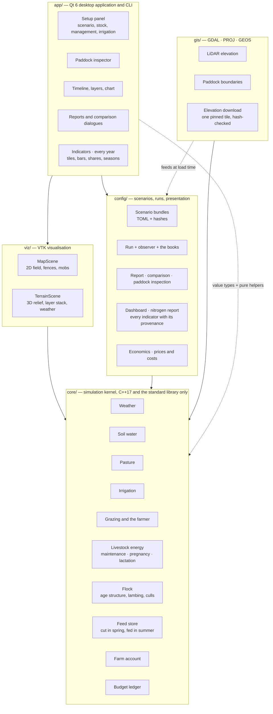
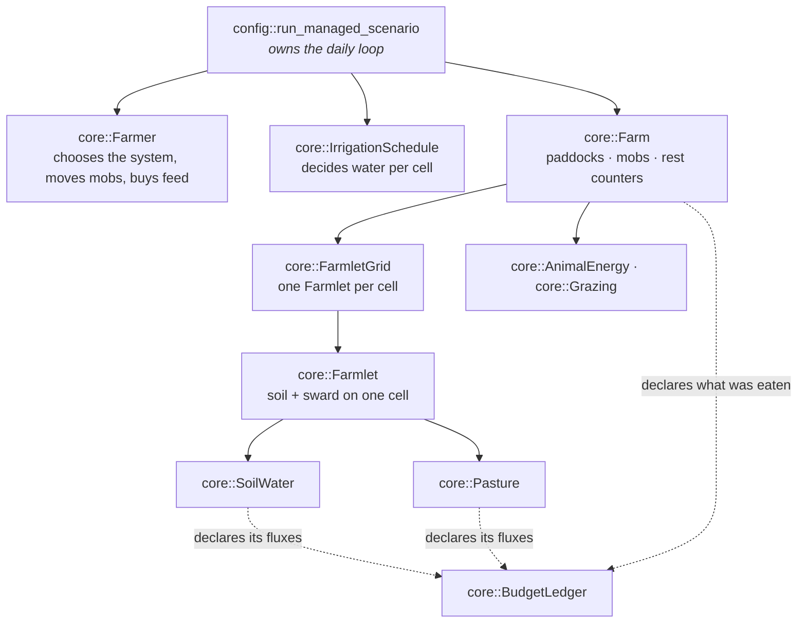
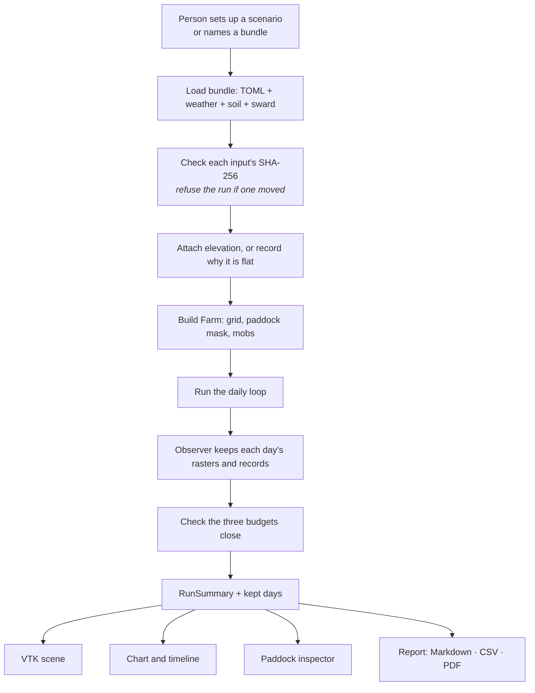
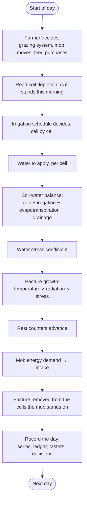
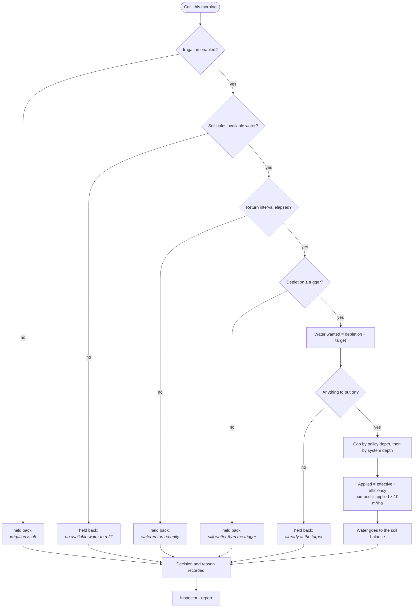
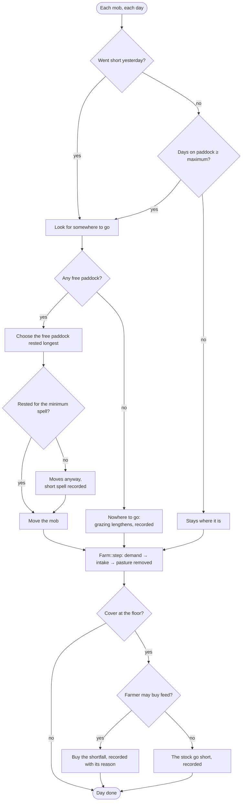
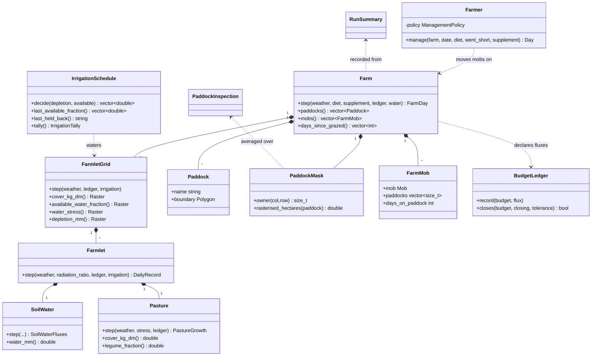
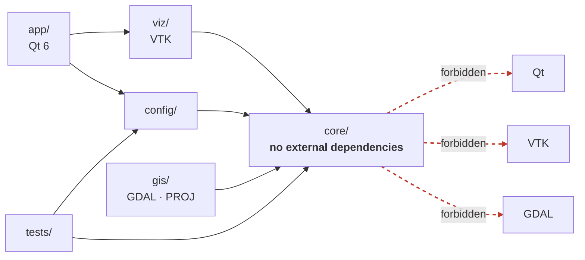
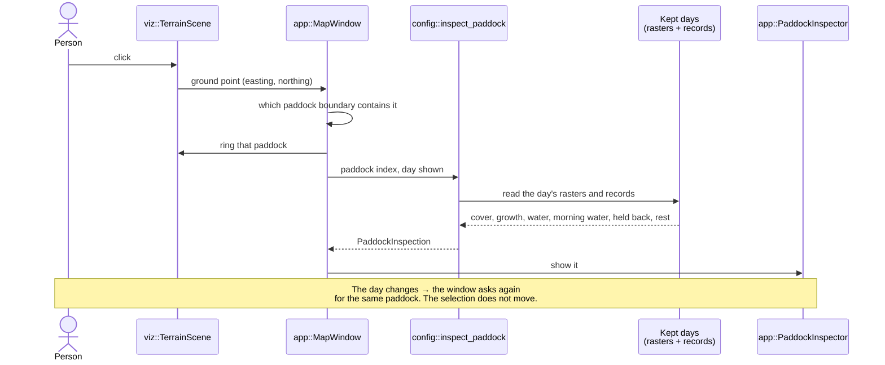
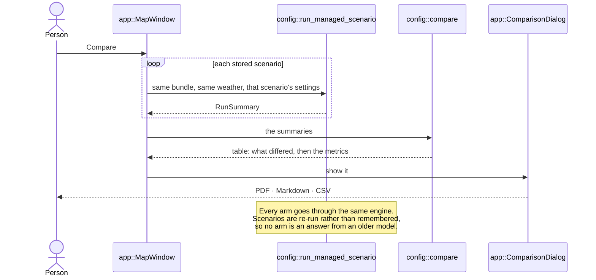

# System architecture

How Paddock is put together, why it is put together that way, and what each part
is not allowed to do.

**This document is about the software.** The agricultural equations, their
sources and their calibration status live in [the model
documents](../model/) and in [the verification
tracker](../validation/verify.md). Where a diagram here shows "pasture growth",
what that means numerically is over there.

Every diagram below was drawn from the code as it stands. A flow that is
pleasant to read and does not match the execution order would be worse than no
diagram, because it would be believed.

## Contents

- [Purpose and scope](#purpose-and-scope)
- [Architecture goals](#architecture-goals)
- [Level 1: the system](#level-1-the-system)
- [Level 2: inside the core](#level-2-inside-the-core)
- [What each module owns](#what-each-module-owns)
- [Flow 1: running a scenario](#flow-1-running-a-scenario)
- [Flow 2: one simulated day](#flow-2-one-simulated-day)
- [Flow 3: the irrigation decision](#flow-3-the-irrigation-decision)
- [Flow 4: the grazing decision](#flow-4-the-grazing-decision)
- [The domain, as types](#the-domain-as-types)
- [Dependency direction](#dependency-direction)
- [Sequence: inspecting a paddock](#sequence-inspecting-a-paddock)
- [Sequence: comparing scenarios](#sequence-comparing-scenarios)
- [Consequences of these choices](#consequences-of-these-choices)

## Purpose and scope

Paddock is a spatially explicit, deterministic pastoral farm simulation
platform. It spans these concerns:

weather · soil water · pasture · irrigation · grazing · livestock · management ·
scenarios · visualisation and reporting

It runs a New Zealand farm year, 1 July to 30 June, one day at a time, over a
grid of cells that belong to real surveyed paddocks — and it keeps every day, so
the year can be scrubbed, inspected and reported on without being run again.

## Architecture goals

These are the properties the structure exists to protect. Each one is enforced
by something, not merely intended.

| Goal | What enforces it |
|---|---|
| **Separation of concerns** — simulation logic is not presentation logic | `core/` compiles and its tests run with no Qt, no VTK, no GDAL |
| **Determinism** — the same inputs give the same output, bit for bit | Every random draw comes from an injected engine keyed by entity ID; a property test runs a year twice and compares |
| **Testability** — the science can be tested without a window | Several hundred tests, of which the scientific classes link `core` and `config` only |
| **Extensibility** — a new species or policy is data, not a class | Species, pastures and farms are TOML; entities are components |
| **Explainability** — a management decision can be accounted for | The model records its decisions; the interface reads them and never re-derives them |
| **Conservation** — nothing appears or vanishes unaccounted for | A budget ledger tracks dry matter, water and nitrogen; a closed run must balance to 1e-9 |

The last two are the ones that shape the code most. Conservation means every
process declares what it took and what it gave. Explainability means the
irrigation schedule writes down *why* it did nothing, because by the evening the
reason is unrecoverable.

## Level 1: the system

The arrows are what may include what, and nothing points out of `core`.

**What the dashed line means, precisely.** `app` does depend on `core` directly,
and it is worth being exact about how, because "the GUI does not touch the core"
would be a slogan rather than a description:

- It uses core's **value types** — `Raster`, `Paddock`, `Date`, the daily weather
  record — to hold and draw what a run produced
- It calls a few **pure functions** that are presentation work rather than farm
  simulation: `sun_position`, `clearness_index`, `sky_from_clearness`, which
  place the sun and colour the sky for the day being shown
- It builds a `PaddockMask`, which decides which cell belongs to which paddock —
  a core algorithm, used here to average a paddock's figures for the inspector

What it does **not** do is run the model. The daily loop, the water balance,
growth, the grazing decision and the irrigation decision are all behind
`config::run_managed_scenario`, and the window learns their results by being
handed them. No biological or management rule is evaluated in `app/` or `viz/`.

## Level 2: inside the core

`Farmlet` is the unit the science happens on: one cell of soil with one sward on
it. `FarmletGrid` is a farm's worth of them, and `Farm` adds the paddock
boundaries, the mobs and the bookkeeping that ties cells to paddocks.

## What each module owns

**`config::run_managed_scenario`** — owns simulated time. It runs the day loop,
calls the farmer, asks the schedule, steps the farm, records the series, and
offers each finished day to an observer. It computes no biology.

**`core::Farm`** — the aggregate: paddocks, mobs, the mask that says which cell
belongs to which paddock, and the count of days since each paddock was grazed.
It steps the grid and then feeds the mobs from the cells they stand on.

**`core::Farmlet`** — one cell. Soil water and sward, stepped in that order,
because growth is limited by the water that is left after the balance runs.

**`core::SoilWater`** — rain plus irrigation in, evapotranspiration and drainage
out, and the FAO-56 stress coefficient that comes out of what is left.

**`core::Pasture`** — the sward: ryegrass and white clover, growth under
temperature, radiation and that stress coefficient, and the nitrogen the clover
fixes.

**`core::IrrigationSchedule`** — decides, per cell, whether to water and how
much; keeps the tally, the fraction it read this morning, and the reason it held
water back.

**`core::Farmer`** — chooses the grazing system from the state of the farm,
moves mobs, and decides what feed to buy. It is the only thing that moves stock.

**`core::BudgetLedger`** — every process declares what it took and gave; the
ledger closes, or the run is reported as unusable.

**`config::PaddockInspection`** — gathers one paddock's day from what the run
recorded. It computes means over a paddock's cells and nothing else: no
thresholds are re-evaluated here.

**`app::MapWindow`** — owns the selection, the day being shown, and the wiring.
It holds every day's rasters so scrubbing does not re-simulate.

## Flow 1: running a scenario

A bundle that fails its hash check is refused rather than run: a scenario whose
inputs have moved is no longer the scenario its results were recorded for.

## Flow 2: one simulated day

This is the order in `config::run_managed_scenario` and `core::Farm::step`, as
written.

Two things in that order matter and are easy to get wrong:

**The farmer moves stock before the day is stepped**, so a mob that moves eats
on the paddock it moved to rather than the one it left.

**Irrigation is decided on the morning's depletion**, before the balance runs.
By the evening the soil holds the rain, has lost the day's evapotranspiration
and has been given the water itself — a paddock watered at 45% can finish the
day at 84%. This is why the schedule keeps what it read, and why the inspector
shows it.

## Flow 3: the irrigation decision

One cell, one morning. The guards are in the order `decide_irrigation` applies
them, and each one records the phrase the inspector later prints.

The chain from a domain rule, through the simulation, to something a person can
read is the whole point of the shape: the interface prints `held_back` and never
re-evaluates a threshold.

## Flow 4: the grazing decision

As `core::Farmer::manage` runs it. **There is no per-paddock "grazeable" test in
this model** — the rule is about the mob and about which ground has rested
longest.

The spell is what the farmer aims at, not a gate. A mob moves onto ground that
has had less rest and the run records that it happened — which is what makes the
shuffle measurable instead of hidden.

## The domain, as types

The core types, not every class in the repository.

## Dependency direction

`scripts/check-dependency-direction.sh` fails the build if `core/` gains an
external include or a global random draw. The point is not purity for its own
sake: it is that the simulation kernel can be built, tested and run on a machine
that has never heard of Qt, which is what makes the scientific suite cheap
enough to run on every commit.

## Sequence: inspecting a paddock

VTK resolves a click to a point on the ground and nothing else. It evaluates no
rules, and it holds no simulation state.

## Sequence: comparing scenarios

Both arms running through one engine is what makes the comparison worth more
than the absolute figures: the same parameters and the same structure are
applied to each. It does not make a comparison exact. The responses those
parameters feed are not linear, so a parameter that is wrong can bias the size
of a difference — more under irrigation than under drought, say — even though
the direction survives.

## Consequences of these choices

Worth stating plainly, because every structure costs something.

**Keeping every day in memory** is what makes the timeline instant and the
inspector honest, and it is why a run holds a year of rasters — about nine
series over 1 280 cells and 366 days for the Lincoln example. The alternative,
re-simulating on scrub, risks showing different numbers on the way back.

**Recording decisions rather than deriving them** means the model carries state
it does not need for the simulation itself — the morning water fraction, the
held-back phrase. That is the price of an interface that cannot disagree with
the model.

**A single-threaded daily step** is a deliberate limit: parallel floating-point
reductions would break the 1e-9 conservation assertions and the golden
baselines. Ensembles and parameter sweeps are meant to be run as separate
processes.

**No inheritance for species or policies.** A deer is farmed stock in one
scenario and a pest in another, and a class tree cannot express that. Entities
are components; species, pastures and farms are TOML.

## See also

- [Model verification and what may be quoted](../validation/verify.md)
- [The model documents](../model/)
- [Build and dependency setup](../setup.md)
- [Architecture decision records](../adr/)
